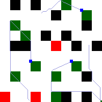

## This is my final submission for Swarm Robotics Software Team Selections

 

 

 

## Problem Description
The problem is based on the world of zooids, where you are their master. The world of zooid is a grid of dimension 200 x 200. As in any real world, there are obstacles occupying some portions of the grid. The obstacles are strictly rectangular in shape. Here is a sample image    

Each zooid is capable of some basic locomotion. If the zooid is at a location X in a grid, then a movement of type 1, would take it to the grid marked as 1, a movement of type 2 would take it to the grid marked 2 and so on.

1 2 3

8 X 4

7 6 5

As such, zooids are pretty unintelligent beings. Your mission, should you choose to accept, is to make them intelligent and intelligent as a whole. You would learn what is an agent, what is an objective, what is environment, what is a more constrained environment, what is intelligence and how swarm intelligence works.

The obstacles (you cannot move through obstacles) are marked in the map in black, the moving blue colored objects are your zooids, the green colored regions are the ones you must visit, and the red colored regions are the ones you should avoid (you can go through them, but you will end up paying twice as much in any other traversable cell). At each level, the goal is to visit all the green colored regions in as minimum number of steps as possible.

### Level 1
The first level, is to make zooid Zoozoo aware of his capabilities, and show him that he can walk efficiently. Zoozoo's initial and final position will be known to you, and you have to guide Zoozoo through the grid to his destination. Once you reach the destination, you will be awarded a score. Your goal is to reach the destination with as little score as possible. This is an example of a single agent, single objective system.

### Level 2
The second level, is to make Zoozoo intelligent enough to go through all the green regions at least once. This is an example of a single agent, but multiple objective system.

### Level 3
They say, third's the charm! Zoozoo finally has a friend. They have many green regions to go through, and they should co-operate among themselves to achieve this goal with minimum steps. This is an example of multi-agent, multi-objective system.

### Level 4
Zoozoo and his friend have now wondered into a swarm. There are many more zooids, each equally capable as Zoozoo. And there are still more than one green regions to go through. Can they cooperate as a group? This should teach them something about swarm systems!

### Level 5
Zoozoo and his friend have now been landed into a harsher territory. It's only two of them and they are still to go through the green regions, but now, there are patches of red regions that they should ideally avoid, because each step through the red region is counted as 2 steps. But then, sometimes, it might be necessary to go through the red regions in order to avoid a longer way through the green one. Hmmmm.. they need some intelligence!

### Level 6
Now a swarm of zooids has joined in to help Zoozoo and his friend. This is the beginning of swarm intelligence. Now, do you feel like a God who programmed his creations to intelligence?

## How to Run

This needs to be run either in a Ubuntu (>18.04) system or in WSL (Ubuntu 18.04) inside Windows.

Clone this repository: (The first command takes you to the user's home directory and the last one takes you inside the task directory)
	
	unix_user@DESKTOP:~$ cd
	unix_user@DESKTOP:~$ git clone https://github.com/shreyase99/SwarmSoftwareTask2021
	unix_user@DESKTOP:~$ cd SwarmSoftwareTask2021

GRANTING PERMISSIONS:
Change the execution permissions of  setup.sh and run.sh by using the following commands:

	unix_user@DESKTOP:~/SwarmSoftwareTask2021$ chmod +x setup.sh
	unix_user@DESKTOP:~/SwarmSoftwareTask2021$ chmod +x run.sh

**FIRST RUN:**

In one terminal, enter the following:

	unix_user@DESKTOP:~/SwarmSoftwareTask2021$ ./setup.sh

Once all dependencies are installed it would start the map server. You should see this:
	
	Running on http://127.0.0.1:5000/ (Press CTRL+C to quit)
	

**In another terminal**, run this command and select the level to attempt: 

	unix_user@DESKTOP:~/SwarmSoftwareTask2021$ python3 controller.py
  
The program would prompt you to enter a level. Start with 1 and work your way upto level 6. The `controller.py` sets up the level, creates bots in the map and, uses the solution written in `code.py` to drive the bots. 

**To view the map** of the simulation, open this file in your browser (works for everyone): 

	showMap.html
	
If you are on WSL, you would need to open Windows Explorer from inside the repository directory. Run the following command to view the files in Explorer. (Mind the dot).

	unix_user@DESKTOP:~/SwarmSoftwareTask2021$  Explorer.exe . 

Locate the `showMap.html` file and open it in the browser. The map shown in the webpage refreshes every 1 second. The following command: `python3 simulation.py` also displays the map, but does not work in WSL without GUI support. (Also, try opening `http://localhost:5000/map` if you are curious.)

 
**NOTE FOR FUTURE RUNS:**  

Instead of running `setup.sh`, which may take some extra time confirming the dependencies, you may directly use:

	unix_user@DESKTOP:~/SwarmSoftwareTask2021$ ./run.sh
	
You need not stop/restart the `run.sh` process everytime, but only when the process had been stopped (Ctrl+C)

 ## Setup done, what next?

Your task is to complete up as many functions/levels as possible in `code.py` and submit your codes through the teams assignment. You need not attempt all the levels, but sure, the more the better your chances are to get into the team. Your functions may not be optimal (in some cases, optimality cannot even be guaranteed!). We would solely judge on how you approach the problem and how much effort you've put in! :)

This problem statement comes with a sample (pretty unintelligent!) submission for level 1 problem (just makes the bot move in random steps). We shall be providing sample (again, unintelligent ones!) for higher levels too.

## Code Structure
There is really not much to play with. There is only one file named `code.py`, which you must edit and fill out the functions. You're encouraged to use solutions from the lower levels to solve problems of higher level. You can refer to the documentations in `api.py`, in case you are unsure about what a command does.

## Working Procedure
(PS: Please go through the problem description to understand the working procedure)

The file `app.py` is responsible for maintaining the grid, the position of the bots, handling multiple command requests and so on. The `controller.py` is responsible for setting up the levels and, simulating multiple bots, using threads. The `code.py` file uses functions from `api.py` to send commands to `app.py` which then replicates what would happen in the zooids' world. The `simulation.py` file, constantly fetches the current map and displays it. simulation.py would not work on WSL instances without a GUI server. In order to close it, please press Ctrl+C, on the terminal you run it.

To attempt a different level, just close the controller.py process and restart it with another level.

